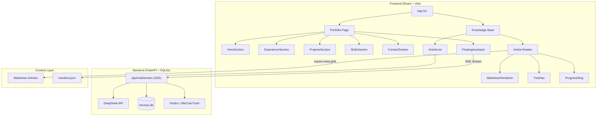

# Minimalist Portfolio &mdash; AI-Powered Personal Site

A modern, bilingual portfolio website with a floating AI chat assistant, knowledge base CMS, and project showcase &mdash; built to demonstrate AI-native development in action.

**Live**: [liumingqing.com](https://liumingqing.com) &ensp;|&ensp; **Open Source**: [GitHub](https://github.com/SirAQing/minimalist-portfolio)


---

## Architecture



## Tech Stack

| Layer | Technology |
|---|---|
| **Frontend** | React 19, TypeScript 6, Vite 8, Tailwind CSS 3 |
| **Animation** | Framer Motion |
| **Icons** | Lucide React |
| **Markdown** | react-markdown, remark-gfm, rehype-highlight, rehype-slug |
| **Backend** | FastAPI, Uvicorn, httpx (SSE streaming) |
| **AI** | DeepSeek API, Ollama (local LLM) |
| **Database** | SQLite (conversation persistence) |
| **Notifications** | Feishu Webhook, PushPlus (WeChat) |
| **Deploy** | Docker Compose |

## Features

### Portfolio Page
- **Typewriter hero** &mdash; animated title with static role descriptions
- **Bilingual** &mdash; full EN/ZH support, persisted via localStorage
- **Dark / Light theme** &mdash; CSS custom properties, class-based toggle
- **Scroll-spy sidebar** &mdash; IntersectionObserver-driven active section tracking
- **6 project cards** &mdash; click to open detail modal with background, key contributions, and quantified impact
- **Enterprise / Personal labels** &mdash; visual distinction between project types
- **Framer Motion animations** &mdash; staggered entrance, smooth transitions

### AI Chat Assistant (Hermes)
- **Floating widget** &mdash; bottom-right corner, toggle open/close
- **SSE streaming** &mdash; real-time token-by-token response
- **Conversation persistence** &mdash; multi-turn context maintained in SQLite
- **Quick actions** &mdash; preset questions for visitors
- **Real-time notifications** &mdash; chat messages synced to Feishu & WeChat
- **Scheduled summaries** &mdash; daily digests at 8:00, 12:00, 17:00
- **Urgent keyword detection** &mdash; triggers instant push notification

### Knowledge Base
- **Article listing** &mdash; featured card + category-grouped list
- **Markdown rendering** &mdash; syntax highlighting, GFM tables, heading anchors
- **Tree navigation** &mdash; auto-extracted h2/h3 outline, scroll-synced
- **Reading progress** &mdash; SVG ring indicator (bottom-right)
- **Bilingual articles** &mdash; language-specific `.md` files in `en/` and `zh/`
- **Manifest-driven** &mdash; `manifest.json` for metadata, `import.meta.glob` for content

## Quick Start

### Prerequisites
- Node.js 18+
- Python 3.10+ (for Hermes backend)
- Docker & Docker Compose (optional, for production deploy)

### 1. Clone

```bash
git clone https://github.com/SirAQing/minimalist-portfolio.git
cd minimalist-portfolio/portfolio-react
```

### 2. Install Frontend Dependencies

```bash
npm install
```

### 3. Start Frontend Dev Server

```bash
npm run dev
# → http://localhost:5173
```

### 4. Start Hermes Backend (for AI chat)

```bash
cd hermes
pip install -r requirements.txt

# Set environment variables
export DEEPSEEK_API_KEY="your-api-key"
export FEISHU_WEBHOOK_URL="https://open.feishu.cn/..."   # optional
export PUSHPLUS_TOKEN="your-token"                        # optional

python main.py
# → http://localhost:8000
```

The Vite dev server proxies `/api` requests to `localhost:8000`.

### 5. Build for Production

```bash
npm run build     # TypeScript check + Vite build → dist/
npm run preview   # Preview production build locally
```

## Project Structure

```
portfolio-react/
├── src/
│   ├── components/
│   │   ├── knowledge/        # Knowledge Base (article reader, tree nav, TOC, progress ring)
│   │   ├── shared/           # Shared UI (SectionTitle)
│   │   ├── HeroSection.tsx   # Typewriter hero with stats & story
│   │   ├── ExperienceSection.tsx  # Work timeline & skill tags
│   │   ├── ProjectsSection.tsx    # Project cards + modal
│   │   ├── ProjectModal.tsx       # Detail modal (background, work, results)
│   │   ├── MiscSections.tsx       # Education, Patents, Skills
│   │   ├── SidebarNav.tsx         # Scroll-spy navigation
│   │   ├── HeaderActions.tsx      # Theme/lang toggles
│   │   └── FloatingAssistant.tsx  # AI chat widget (SSE streaming)
│   ├── content/
│   │   ├── manifest.json          # Article metadata (title, tags, date, category)
│   │   └── articles/{en,zh}/     # Markdown articles (language-specific)
│   ├── hooks/
│   │   └── useHashRouter.ts       # Hash-based client-side routing
│   ├── i18n.tsx                   # Translations (EN/ZH) + I18nProvider
│   ├── index.css                  # Tailwind + CSS custom properties (theme tokens)
│   ├── App.tsx                    # Root layout & routing
│   └── main.tsx                   # Entry point
├── hermes/
│   ├── main.py                    # FastAPI server (chat, SSE, notifications)
│   ├── config.py                  # System prompt & environment config
│   ├── llm.py                     # DeepSeek API integration
│   ├── models.py                  # SQLite conversation persistence
│   └── notify.py                  # Feishu & WeChat push notifications
├── tailwind.config.js
├── vite.config.ts
└── package.json
```

## Adding Content

### Articles

1. Add `.md` file to `src/content/articles/{en,zh}/`
2. Add entry to `src/content/manifest.json`:

```json
{
  "slug": "my-article",
  "title": "文章标题",
  "titleEn": "Article Title",
  "source": "https://original-source.url",
  "sourceRepo": "https://github.com/author/repo",
  "tags": ["标签1", "标签2"],
  "tagsEn": ["Tag1", "Tag2"],
  "date": "2026-06-21",
  "category": "分类",
  "categoryEn": "Category",
  "description": "文章摘要",
  "descriptionEn": "Article summary"
}
```

For original content, leave `source` and `sourceRepo` empty &mdash; the copyright footer will be hidden.

### Translations

All UI text lives in `src/i18n.tsx`. Add keys to both `en` and `zh` objects. Use `t('key.path')` in components.

### Theme Tokens

Edit the `:root` (light) and `:root.dark` (dark) blocks in `src/index.css` to change colors globally.

## Hermes Backend API

| Endpoint | Method | Description |
|---|---|---|
| `/api/health` | GET | Health check |
| `/api/chat` | POST | Non-streaming chat |
| `/api/chat/stream` | POST | SSE streaming chat |
| `/api/conversations/{id}/messages` | GET | Conversation history |
| `/api/notify/test` | POST | Test Feishu/WeChat notifications |

### Environment Variables

| Variable | Required | Description |
|---|---|---|
| `DEEPSEEK_API_KEY` | Yes | DeepSeek API key |
| `DEEPSEEK_BASE_URL` | No | API base URL (default: `https://api.deepseek.com`) |
| `DEEPSEEK_MODEL` | No | Model name (default: `deepseek-chat`) |
| `FEISHU_WEBHOOK_URL` | No | Feishu bot webhook for notifications |
| `PUSHPLUS_TOKEN` | No | PushPlus token for WeChat push |
| `SYSTEM_PROMPT` | No | Custom system prompt for the AI assistant |
| `CORS_ORIGINS` | No | Allowed CORS origins |

## License

MIT &mdash; see [LICENSE](LICENSE) for details.
