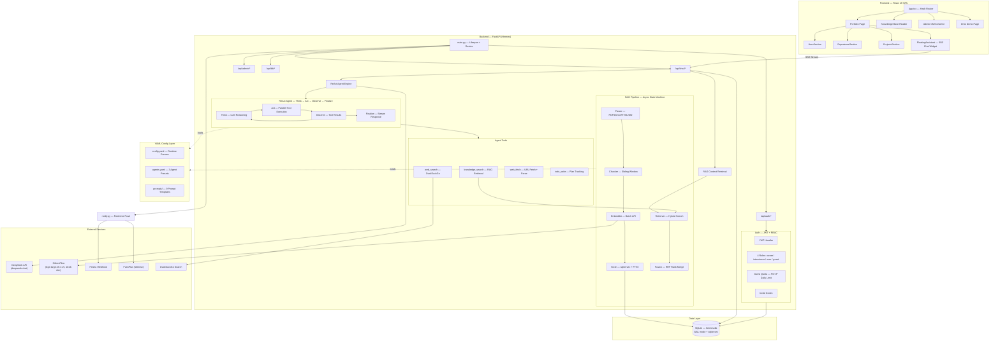

# Minimalist Portfolio &mdash; AI-Native Personal Site

> 一个集 ReAct Agent、RAG 管线、知识库 CMS 于一体的 AI 原生个人作品集。
>
> A full-stack portfolio that demonstrates **AI engineering in production** &mdash; featuring a ReAct agent engine, a retrieval-augmented generation (RAG) pipeline, JWT + RBAC auth, and a knowledge base CMS, all built with React 19 + FastAPI.

**Live**: [liumingqing.com](https://liumingqing.com) &ensp;|&ensp; **Source**: [GitHub](https://github.com/SirAQing/minimalist-portfolio) &ensp;|&ensp; **License**: MIT

<!-- TODO: Replace with a hosted screenshot URL (e.g. GitHub raw, imgur, or docs/assets/screenshot.png committed to the repo) -->


---

## Table of Contents / 目录

- [Highlights / 项目亮点](#highlights--项目亮点)
- [Architecture / 系统架构](#architecture--系统架构)
- [Tech Stack / 技术栈](#tech-stack--技术栈)
- [AI Engineering Deep Dive / AI 工程详解](#ai-engineering-deep-dive--ai-工程详解)
- [Features / 功能一览](#features--功能一览)
- [Quick Start / 快速开始](#quick-start--快速开始)
- [Project Structure / 项目结构](#project-structure--项目结构)
- [API Reference / API 参考](#api-reference--api-参考)
- [Configuration / 配置说明](#configuration--配置说明)
- [Testing / 测试](#testing--测试)
- [Deployment / 部署](#deployment--部署)
- [License](#license)

---

## Highlights / 项目亮点

> 本项目的核心价值不在于"又一个作品集网站"，而在于将 **ReAct Agent 推理框架**和 **RAG 检索增强生成管线** 在生产环境落地，完整展示 AI 工程化能力。

This project is built to demonstrate end-to-end AI engineering capabilities:

- **ReAct Agent Engine** &mdash; A Think → Act → Observe → Finalize loop with parallel tool execution, SSE-streamed events, and automatic token compression. Ported from a Go reference (WeKnora) to Python, proving cross-language architectural transferability.
- **Full RAG Pipeline** &mdash; Document upload → parsing (PDF/DOCX/HTML/MD) → sliding-window chunking → batch embedding → hybrid retrieval (vector + keyword) → RRF rank fusion. No external vector DB required &mdash; powered by `sqlite-vec`.
- **YAML-Driven Config** &mdash; Zero hardcoded prompts. 9 prompt templates, 3 agent presets, and all runtime parameters are externalized to YAML, mirroring production-grade MLOps practices.
- **JWT + RBAC Auth** &mdash; 4-tier role system (owner / interviewer / user / guest), per-IP guest quotas, invite-code onboarding for interviewers, and auto-bootstrapped owner accounts.
- **Production-Ready** &mdash; Docker Compose orchestration, nginx SSE proxying, GitHub Actions keep-alive cron, and Render.com deployment with persistent volumes.

---

## Architecture / 系统架构



### Request Flow / 请求流

1. **Visitor chat** &mdash; Frontend `FloatingAssistant` sends POST to `/api/chat/agent`, which streams SSE events (`think` → `tool_call` → `tool_result` → `chunk` → `done`).
2. **RAG retrieval** &mdash; `should_use_rag()` checks if the query needs KB context; if yes, `retrieve_context()` runs hybrid search (vector + keyword) and fuses results via RRF.
3. **Agent loop** &mdash; `AgentEngine.run()` iterates up to 20 times: LLM reasons (Think), executes tools in parallel (Act), observes results (Observe), and streams the final answer (Finalize).
4. **Token compression** &mdash; When conversation history exceeds 80% of `max_context_tokens`, older messages are consolidated to preserve context window.
5. **Notifications** &mdash; Real-time Feishu/WeChat push on each message; scheduled daily summaries at configurable hours; urgent keyword detection triggers instant alerts.

---

## Tech Stack / 技术栈

| Layer | Technology | Version |
|---|---|---|
| **Frontend** | React, TypeScript, Vite | 19.2 / ~6.0 / 8.0 |
| **Styling** | Tailwind CSS (CSS-variable-driven theme) | 3.4 |
| **Animation** | Framer Motion | 12.4 |
| **Icons** | Lucide React | 1.20 |
| **Markdown** | react-markdown, remark-gfm, rehype-highlight, rehype-slug | 10.1 |
| **Backend** | FastAPI, Uvicorn, httpx | 0.115 / 0.30 / 0.27 |
| **Validation** | Pydantic | 2.9 |
| **Database** | SQLite (WAL mode) + sqlite-vec (vector search) + FTS5 (keyword) | 0.1.6 |
| **Tokenization** | tiktoken | 0.8 |
| **Auth** | PyJWT, bcrypt | 2.9 / 4.2 |
| **Document Parsing** | PyMuPDF (PDF), python-docx (DOCX), built-in HTML/MD/JSON/TXT | 1.24 / 1.1 |
| **LLM** | DeepSeek API (`deepseek-chat`) | — |
| **Embedding** | SiliconFlow (`BAAI/bge-large-zh-v1.5`, 1024-dim) | — |
| **Notifications** | Feishu Webhook, PushPlus (WeChat) | — |
| **Web Search** | DuckDuckGo (agent tool) | — |
| **Deploy** | Docker Compose, nginx, Render.com | — |
| **CI/CD** | GitHub Actions (keep-alive cron) | — |
| **Testing** | pytest, pytest-asyncio | 8.3 / 0.24 |

---

## AI Engineering Deep Dive / AI 工程详解

> 以下三个子系统是本项目的工程核心，也是求职 AI Engineer 岗位的核心展示能力。

### ReAct Agent Engine

The agent engine (`hermes/core/agent/`) implements the ReAct (Reasoning + Acting) pattern with a state-machine loop:

```
User Query
    │
    ▼
┌─────────┐    ┌─────────┐    ┌─────────┐
│  Think  │───▶│  Act    │───▶│ Observe │
│ (LLM    │    │ (Paral- │    │ (Tool   │
│  reason)│    │  lel    │    │  results│
│         │◀───│  tools) │◀───│         │
└─────────┘    └─────────┘    └─────────┘
    │                               │
    │  max 20 iterations            │
    └───────── loop ────────────────┘
                │
                ▼
          ┌──────────┐
          │ Finalize │──▶ SSE stream to client
          │ (Stream) │
          └──────────┘
```

**Key design decisions:**

- **Parallel tool execution** &mdash; Multiple tools can be called in a single Act step; results are gathered before the next Think.
- **Token compression** &mdash; When history exceeds 80% of `max_context_tokens` (default 32K), a consolidator summarizes older turns to prevent context overflow.
- **4 builtin tools** &mdash; `knowledge_search` (RAG retrieval), `web_search` (DuckDuckGo), `web_fetch` (URL fetch + parse), `todo_write` (plan tracking). Tools implement a `Tool` interface (`Name` / `Description` / `Parameters` / `Execute`).
- **SSE event protocol** &mdash; Each loop iteration emits typed events (`think`, `tool_call`, `tool_result`, `chunk`, `done`, `error`) that the frontend renders in real-time with separate panels for reasoning and tool calls.

**Architecture origin:** Ported from WeKnora's Go implementation (`agent/engine.go`), reimplemented in Python with `asyncio` for native concurrency.

### RAG Pipeline

The RAG pipeline (`hermes/core/rag/`) is an async state machine that processes documents from upload to retrieval-ready:

```
Upload → Pending → Parsing → Chunking → Embedding → Ready
                                                        │
                                                        ▼
                        Query → Hybrid Search → RRF Fusion → Context
```

| Stage | Module | Description |
|---|---|---|
| **Parsing** | `parser.py` | PDF (PyMuPDF), DOCX (python-docx), HTML, Markdown, JSON, TXT → plain text |
| **Chunking** | `chunker.py` | Sliding-window chunking with configurable size (512) and overlap (50) |
| **Embedding** | `embedder.py` | Batch API calls to SiliconFlow (`bge-large-zh-v1.5`, 1024-dim) |
| **Storage** | `chunk_repo.py` | SQLite tables with `sqlite-vec` vector index + FTS5 keyword index |
| **Retrieval** | `retriever.py` | Hybrid: vector similarity search + FTS5 keyword search, run in parallel |
| **Fusion** | `fusion.py` | Reciprocal Rank Fusion (RRF) merges vector and keyword results |
| **Context** | `rag_chat.py` | `should_use_rag()` decides if RAG is needed; `retrieve_context()` returns formatted context |

**No external vector database** &mdash; `sqlite-vec` provides in-process vector search, keeping the deployment footprint minimal (single SQLite file). This mirrors WeKnora's Lite mode architecture.

### YAML-Driven Configuration

All prompts and runtime parameters are externalized &mdash; zero hardcoded strings in Python source:

```
hermes/config_files/
├── config.yaml          # Runtime params: chunking, RAG, agent, guest quota, LLM
├── agents.yaml          # 3 builtin agent presets (see below)
└── prompts/             # 9 prompt templates with {{variable}} interpolation
    ├── system_prompt.yaml
    ├── agent_system.yaml
    ├── context_template.yaml
    ├── fallback.yaml
    └── ...
```

**3 builtin agent presets** (from `agents.yaml`):

| Preset | Mode | Tools | Use Case |
|---|---|---|---|
| Quick Answer | `quick-answer` | None (RAG only) | Fast KB Q&A without reasoning overhead |
| Smart Reasoning | `smart-reasoning` | All 4 tools | Full ReAct loop with web search + KB |
| General Chat | `pure-chat` | None | Casual conversation, no KB dependency |

---

## Features / 功能一览

### Portfolio Frontend

- **Typewriter hero** with animated role descriptions and stat badges
- **Bilingual EN/ZH** &mdash; custom i18n context, ~125 keys, persisted via localStorage
- **Dark / Light theme** &mdash; CSS custom properties, class-based toggle, all colors as Tailwind tokens
- **Scroll-spy sidebar** &mdash; IntersectionObserver-driven active section tracking
- **6 project cards** with detail modals (background, key contributions, quantified impact)
- **Framer Motion** staggered entrance animations and smooth transitions
- **Hash-based routing** (no React Router) across 4 pages: Portfolio, Knowledge Base, Admin, Chat Demo

### AI Chat Assistant (Hermes)

- **Floating SSE widget** &mdash; bottom-right, streams tokens in real-time
- **ReAct agent mode** &mdash; separate panels for reasoning (Think) and tool calls (Act), both SSE-streamed
- **Conversation persistence** &mdash; multi-turn context in SQLite with 20-message window
- **3 chat modes** &mdash; Quick Answer (RAG-only), Smart Reasoning (full ReAct), General Chat
- **Real-time notifications** &mdash; Feishu + WeChat push on every visitor message
- **Scheduled summaries** &mdash; daily digests at configurable hours (default 8:00, 12:00, 17:00)
- **Urgent keyword detection** &mdash; instant push when visitors mention "human", "contact", etc.

### Knowledge Base CMS

- **Public reader** &mdash; markdown articles rendered with syntax highlighting, GFM tables, heading anchors
- **Tree navigation** &mdash; auto-extracted h2/h3 outline, scroll-synced
- **Reading progress** &mdash; SVG ring indicator
- **Admin CMS** (`#/admin`) &mdash; owner-only, drag-drop document upload, live pipeline status, retrieval testing
- **Multi-format ingestion** &mdash; PDF, DOCX, HTML, Markdown, JSON, TXT via file upload, batch upload, or URL fetch
- **Manifest-driven articles** &mdash; `manifest.json` metadata + `import.meta.glob` content loading

### Auth & RBAC

- **4-tier role system** &mdash; `owner` (full access), `interviewer` (read-only KB + chat), `user` (read-only KB), `guest` (limited chat quota)
- **JWT** &mdash; access tokens (30 min) + refresh tokens (7 days), stored in `refresh_tokens` table with revocation support
- **Guest quota** &mdash; per-IP daily limit (default 5), tracked in `guest_quotas` table
- **Invite codes** &mdash; owner generates time-limited codes; interviewers redeem for instant account creation (no registration)
- **Auto-bootstrapped owner** &mdash; first startup creates the owner account from env vars

---

## Quick Start / 快速开始

### Prerequisites

- Node.js 18+
- Python 3.10+
- Docker & Docker Compose (optional, for production deploy)

### Option A: Local Development / 本地开发

```bash
# 1. Clone
git clone https://github.com/SirAQing/minimalist-portfolio.git
cd minimalist-portfolio/portfolio-react

# 2. Frontend setup
npm install
npm run dev          # → http://localhost:8080 (Vite proxies /api → :8000)

# 3. Backend setup
cd hermes
pip install -r requirements.txt

# 4. Configure environment
cp ../.env.example ../.env
# Edit .env — at minimum set DEEPSEEK_API_KEY and EMBEDDING_API_KEY

# 5. Start backend
python main.py       # → http://localhost:8000
```

The Vite dev server proxies all `/api/*` requests to `localhost:8000`, so the frontend and backend run independently in development.

### Option B: Docker Compose / Docker 一键启动

```bash
cd portfolio-react
cp .env.example .env
# Edit .env — fill in API keys

docker compose up -d
# → Frontend: http://localhost:80
# → Backend:  http://localhost:8000
```

Docker Compose orchestrates two services: `portfolio` (nginx serving the built React app with `/api/` reverse proxy) and `hermes-api` (FastAPI with a persistent volume at `/app/data`).

---

## Project Structure / 项目结构

```
minimalist-portfolio/
├── portfolio-react/                # Main application root
│   ├── src/                        # ── Frontend (React 19 + TypeScript) ──
│   │   ├── main.tsx                # Entry point
│   │   ├── App.tsx                 # Root: I18nProvider + AuthProvider + hash routing
│   │   ├── i18n.tsx                # EN/ZH translations (~125 keys) + I18nProvider
│   │   ├── index.css               # Tailwind + CSS custom properties (theme tokens)
│   │   ├── auth/AuthContext.tsx    # JWT login state, token refresh
│   │   ├── hooks/useHashRouter.ts  # Hash-based client-side routing
│   │   ├── content/
│   │   │   ├── manifest.json       # Article metadata (bilingual fields)
│   │   │   └── articles/{en,zh}/   # 6 bilingual markdown articles
│   │   └── components/
│   │       ├── HeroSection.tsx     # Typewriter hero + stat badges
│   │       ├── ExperienceSection.tsx
│   │       ├── ProjectsSection.tsx # Project cards + detail modal
│   │       ├── MiscSections.tsx    # Education, certifications, skills
│   │       ├── SidebarNav.tsx      # Scroll-spy navigation
│   │       ├── HeaderActions.tsx   # Theme + language toggles
│   │       ├── FloatingAssistant.tsx  # AI chat widget (SSE streaming)
│   │       ├── ChatPage.tsx        # Standalone ReAct agent demo page
│   │       ├── AuthModal.tsx       # Login / register modal
│   │       ├── admin/AdminPage.tsx # KB CMS (owner-only)
│   │       ├── knowledge/          # KB reader (KnowledgeBase, MarkdownRenderer,
│   │       │                       #   TreeNav, TableOfContents, ProgressRing)
│   │       └── shared/SectionTitle.tsx
│   │
│   ├── hermes/                     # ── Backend (FastAPI) ──
│   │   ├── main.py                 # FastAPI entry: lifespan, chat/SSE/agent endpoints
│   │   ├── config.py               # Env-driven config + system prompt
│   │   ├── llm.py                  # DeepSeek API integration (stream + non-stream)
│   │   ├── models.py               # SQLite schema + CRUD (raw sqlite3)
│   │   ├── notify.py               # Feishu webhook + PushPlus notifications
│   │   ├── api/                    # API route modules
│   │   │   ├── auth.py             # Register / login / refresh / me / invite redeem
│   │   │   ├── admin.py            # Owner-only: invite codes, system settings
│   │   │   └── kb.py               # KB CRUD + document upload + search test
│   │   ├── core/
│   │   │   ├── settings_repo.py   # Dynamic per-mode LLM settings (DB-backed)
│   │   │   ├── agent/              # ReAct agent engine
│   │   │   │   ├── engine.py       # Main loop (max 20 iterations)
│   │   │   │   ├── think.py        # LLM reasoning step
│   │   │   │   ├── act.py          # Parallel tool execution
│   │   │   │   ├── observe.py      # Tool result processing
│   │   │   │   ├── finalize.py     # Stream final response
│   │   │   │   ├── events.py       # SSE event types (think/tool_call/...)
│   │   │   │   ├── memory/consolidator.py  # Context summarization
│   │   │   │   ├── token/compress.py       # Token budget management
│   │   │   │   └── tools/          # 4 builtin tools
│   │   │   │       ├── base.py / registry.py / builtin.py
│   │   │   │       ├── knowledge_search.py  # RAG retrieval
│   │   │   │       ├── web_search.py        # DuckDuckGo
│   │   │   │       ├── web_fetch.py         # URL fetch + parse
│   │   │   │       └── todo_write.py        # Plan tracking
│   │   │   ├── auth/               # JWT + RBAC
│   │   │   │   ├── jwt_handler.py  # Access + refresh token creation/decode
│   │   │   │   ├── password.py     # bcrypt hashing
│   │   │   │   ├── deps.py         # FastAPI dependencies (UserContext)
│   │   │   │   ├── user_repo.py    # User CRUD
│   │   │   │   ├── invite_repo.py  # Invite code CRUD
│   │   │   │   ├── guest_quota.py  # Per-IP daily quota
│   │   │   │   └── init_owner.py   # Auto-bootstrap owner on first startup
│   │   │   ├── rag/                # RAG pipeline
│   │   │   │   ├── pipeline.py     # Async state machine (ingest_document)
│   │   │   │   ├── parser.py       # PDF/DOCX/HTML/MD/JSON → text
│   │   │   │   ├── chunker.py      # Sliding-window chunking
│   │   │   │   ├── embedder.py     # Batch embedding (SiliconFlow)
│   │   │   │   ├── retriever.py    # Hybrid search (vector + keyword)
│   │   │   │   ├── fusion.py       # RRF rank fusion
│   │   │   │   ├── rag_chat.py     # should_use_rag() + retrieve_context()
│   │   │   │   ├── chunk_repo.py   # Chunk storage (sqlite-vec + FTS5)
│   │   │   │   ├── kb_repo.py      # KB + document CRUD
│   │   │   │   └── tokenizer.py    # CJK-aware tokenization
│   │   │   └── config/             # YAML loaders
│   │   │       ├── config_loader.py
│   │   │       ├── prompt_loader.py
│   │   │       └── agents_loader.py
│   │   ├── config_files/           # YAML-driven config (no hardcoded prompts)
│   │   │   ├── config.yaml         # Runtime params (chunking, RAG, agent, quota)
│   │   │   ├── agents.yaml         # 3 builtin agent presets
│   │   │   └── prompts/            # 9 prompt templates
│   │   ├── scripts/
│   │   │   └── ingest_articles.py  # Bulk article ingestion
│   │   └── tests/                  # 26 test files, 120+ tests
│   │       ├── conftest.py         # MockEmbedder + temp DB isolation
│   │       └── test_*.py           # Agent, auth, RAG, config, pipeline tests
│   │
│   ├── docker-compose.yml          # 2-service orchestration
│   ├── Dockerfile.frontend         # Multi-stage: Node 22 build → nginx
│   ├── Dockerfile (hermes/)        # Python 3.12-slim, non-root user
│   ├── nginx.conf                  # Reverse proxy + SPA fallback + SSE support
│   ├── vite.config.ts              # Dev proxy /api → :8000
│   ├── tailwind.config.js          # CSS-variable-driven theme tokens
│   └── .env.example                # Full environment template
│
├── docs/                           # Design documents
│   ├── project-analysis-report.md
│   ├── hermes-chat-design.md
│   ├── data-flow.mermaid
│   └── plans/
│       ├── 2026-06-28-rag-agent-refactoring.md
│       └── 2026-06-28-implementation-plan.md
├── .github/workflows/
│   └── keep-alive.yml              # Cron ping every 10 min (Render cold-start mitigation)
├── CLAUDE.md                       # AI coding assistant guidance
├── LICENSE                         # MIT
└── README.md                       # This file
```

---

## API Reference / API 参考

### Chat Endpoints

| Endpoint | Method | Auth | Description |
|---|---|---|---|
| `/api/health` | GET | None | Health check |
| `/api/warmup` | GET | None | Cold-start warmup (touches DB, returns latency) |
| `/api/chat` | POST | Guest+ | Non-streaming chat (RAG-enhanced) |
| `/api/chat/stream` | POST | Guest+ | SSE streaming chat |
| `/api/chat/agent` | POST | Guest+ | ReAct agent SSE stream (`think` → `tool_call` → `tool_result` → `chunk` → `done`) |
| `/api/conversations/{conv_id}/messages` | GET | None | Conversation history |
| `/api/agent/tools` | GET | Guest+ | List available agent tools |
| `/api/notify/test` | POST | None | Test Feishu/WeChat notifications |

### Auth Endpoints (`/api/auth`)

| Endpoint | Method | Auth | Description |
|---|---|---|---|
| `/api/auth/register` | POST | None | Register new user (role: `user`) |
| `/api/auth/login` | POST | None | Login with email + password |
| `/api/auth/refresh` | POST | Refresh token | Exchange refresh token for new access token |
| `/api/auth/me` | GET | Guest+ | Current user/guest info + quota remaining |
| `/api/auth/warmup` | GET | Guest+ | Auth status probe (login + quota) |
| `/api/auth/interviewer/redeem` | POST | None | Redeem invite code for interviewer account |

### Admin Endpoints (`/api/admin`) — Owner only

| Endpoint | Method | Description |
|---|---|---|
| `/api/admin/invites` | POST | Create interview invite code |
| `/api/admin/invites` | GET | List all invite codes |
| `/api/admin/settings` | GET | Get all system settings (API keys masked) |
| `/api/admin/settings` | PUT | Update system settings (LLM, embedding, RAG, per-mode config) |
| `/api/admin/settings/reset/{key}` | POST | Reset a single setting to default |

### Knowledge Base Endpoints (`/api/kb`)

| Endpoint | Method | Auth | Description |
|---|---|---|---|
| `/api/kb` | POST | Owner | Create knowledge base |
| `/api/kb` | GET | Login | List KBs (owner: all; others: public only) |
| `/api/kb/{kb_id}` | GET | Login | Get KB details |
| `/api/kb/{kb_id}` | DELETE | Owner | Delete KB |
| `/api/kb/{kb_id}/link` | POST | Owner | Toggle KB link to AI assistant (visitor/demo/both) |
| `/api/kb/supported-types` | GET | Login | Supported file extensions |
| `/api/kb/{kb_id}/documents` | POST | Owner | Upload document (md/txt/html/json/pdf/docx) |
| `/api/kb/{kb_id}/documents/batch` | POST | Owner | Batch upload (max 20 files) |
| `/api/kb/{kb_id}/documents/url` | POST | Owner | Ingest from URL |
| `/api/kb/{kb_id}/documents` | GET | Login | List documents in KB |
| `/api/kb/documents/{doc_id}/status` | GET | Login | Document pipeline status |
| `/api/kb/{kb_id}/documents/status/{status}` | GET | Login | List documents by pipeline status |
| `/api/kb/documents/{doc_id}/chunks` | GET | Owner | View document chunks (debug) |
| `/api/kb/documents/{doc_id}` | DELETE | Owner | Delete document + chunks |
| `/api/kb/search` | POST | Login | Hybrid search test (vector + keyword + RRF) |

---

## Configuration / 配置说明

### Environment Variables

Copy `.env.example` to `.env` and fill in values. See the file for full documentation.

| Variable | Required | Default | Description |
|---|---|---|---|
| `DEEPSEEK_API_KEY` | **Yes** | — | DeepSeek LLM API key |
| `DEEPSEEK_BASE_URL` | No | `https://api.deepseek.com` | LLM API base URL |
| `DEEPSEEK_MODEL` | No | `deepseek-chat` | Model name |
| `EMBEDDING_API_KEY` | **Yes** | — | Embedding API key (SiliconFlow) |
| `EMBEDDING_BASE_URL` | No | `https://api.siliconflow.cn/v1` | Embedding API base URL |
| `EMBEDDING_MODEL` | No | `BAAI/bge-large-zh-v1.5` | Embedding model |
| `EMBEDDING_DIMENSION` | No | `1024` | Vector dimension |
| `EMBEDDING_MAX_TOKENS` | No | `512` | Max tokens per embedding input |
| `EMBEDDING_BATCH_SIZE` | No | `16` | Batch size for embedding API calls |
| `CHUNK_SIZE` | No | `512` | Chunk size (tokens) |
| `CHUNK_OVERLAP` | No | `50` | Chunk overlap (tokens) |
| `RAG_TOP_K` | No | `30` | Initial retrieval count |
| `RAG_FINAL_K` | No | `5` | Final context chunks |
| `RRF_K` | No | `60` | RRF smoothing constant |
| `RRF_VECTOR_WEIGHT` | No | `1.0` | Vector search weight in fusion |
| `RRF_KEYWORD_WEIGHT` | No | `1.0` | Keyword search weight in fusion |
| `FEISHU_WEBHOOK_URL` | No | — | Feishu bot webhook for notifications |
| `PUSHPLUS_TOKEN` | No | — | PushPlus token for WeChat push |
| `SUMMARY_SCHEDULE_HOURS` | No | `8,12,17` | Daily summary hours (comma-separated) |
| `URGENT_KEYWORDS` | No | `人工,联系本人,...` | Keywords that trigger instant push |
| `CORS_ALLOW_ALL` | No | `true` | Allow all CORS origins (public portfolio) |
| `CORS_ORIGINS` | No | `http://localhost:5173,...` | Allowed origins (when `CORS_ALLOW_ALL=false`; note: update to `:8080` to match dev server) |
| `DATABASE_PATH` | No | `hermes.db` | SQLite file path (Docker: `/app/data/hermes.db`) |
| `JWT_SECRET_KEY` | No | auto-generated | JWT signing secret (set for production) |
| `ACCESS_TOKEN_EXPIRE_MINUTES` | No | `30` | Access token TTL |
| `REFRESH_TOKEN_EXPIRE_DAYS` | No | `7` | Refresh token TTL |
| `OWNER_EMAIL` | No | `owner@example.com` | Auto-created owner account email |
| `OWNER_INITIAL_PASSWORD` | No | `changeme123` | Owner initial password (change immediately) |
| `GUEST_DAILY_LIMIT` | No | `5` | Per-IP guest chat quota per day |

### YAML Config Files

Runtime parameters are also defined in `hermes/config_files/`:

- **`config.yaml`** &mdash; Server, conversation, KB chunking, RAG retrieval, agent limits, guest quota, LLM defaults.
- **`agents.yaml`** &mdash; 3 builtin agent presets (Quick Answer, Smart Reasoning, General Chat) with per-agent tool, temperature, and retrieval settings.
- **`prompts/`** &mdash; 9 prompt template YAMLs with `{{variable}}` interpolation. No prompts are hardcoded in Python source.

---

## Testing / 测试

The backend has **26 test files with 120+ tests** covering the agent engine, auth system, RAG pipeline, and config layer.

```bash
cd portfolio-react/hermes

# Run all tests
pytest

# Run a specific test file
pytest tests/test_agent_act.py

# Run by keyword
pytest -k "test_rrf"

# Run with verbose output
pytest -v
```

**Test isolation:** Each test run uses a temporary SQLite database. An `autouse` fixture wipes all tables between tests. A `MockEmbedder` fixture avoids hitting real embedding APIs.

Test coverage includes: agent act/think/observe/finalize, builtin tools, token compression, events, auth API, JWT, password hashing, user/invite repos, guest quota, chunker, chunk repo, embedder, fusion (RRF), pipeline, RAG chat, retriever, tokenizer, config system, and the ingest script.

---

## Deployment / 部署

### Docker Compose (Recommended)

```bash
cd portfolio-react
cp .env.example .env
# Edit .env with production values

docker compose up -d
```

**Services:**

| Service | Image | Port | Description |
|---|---|---|---|
| `hermes-api` | Python 3.12-slim | 8000 | FastAPI backend, non-root user, healthcheck via `curl /api/health` |
| `portfolio` | nginx:alpine | 80 | Multi-stage build (Node 22 → nginx), reverse-proxies `/api/` to backend |

**nginx configuration highlights:**
- `proxy_buffering off` on `/api/` for SSE streaming support
- 3600s read timeout for long agent runs
- SPA fallback (`try_files $uri /index.html`)
- 1-year immutable cache for static assets
- 50MB body limit for document uploads

### Render.com (Production)

The live site runs on Render.com's free tier:
- **Backend** &mdash; `hermes-api-toki.onrender.com` (FastAPI web service)
- **Frontend** &mdash; Built with relative `/api/` paths, served via nginx
- **Keep-alive** &mdash; `.github/workflows/keep-alive.yml` runs a GitHub Actions cron (`*/10 * * * *`) that pings `/api/warmup` to prevent free-tier cold starts

### Build Frontend for Production

```bash
cd portfolio-react
npm run build      # TypeScript check + Vite build → dist/
npm run preview    # Preview production build locally
```

---

## License

MIT &mdash; see [LICENSE](LICENSE) for details.
