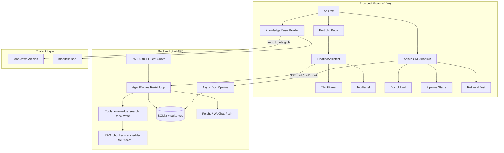

# Minimalist Portfolio &mdash; AI-Native Personal Site

A modern, bilingual portfolio website with a **ReAct Agent** chat assistant, **RAG knowledge base** with admin CMS, and project showcase &mdash; built to demonstrate AI-native full-stack development in action.

**Live**: [liumingqing.com](https://liumingqing.com) &ensp;|&ensp; **Open Source**: [GitHub](https://github.com/SirAQing/portfolio-hermes)


---

## What makes it different

Most portfolio sites are static. This one ships with a **production-grade AI backend**:

- **ReAct Agent** (not a plain chatbot) &mdash; thinks → calls tools → observes → answers, with the full reasoning loop streamed to the UI in real time so visitors can watch the agent work.
- **RAG knowledge base** &mdash; upload `.md`/`.txt`/`.html`/`.json` documents, async pipeline parses → chunks → embeds → stores in `sqlite-vec`. Retrieval uses **RRF fusion** (vector + keyword).
- **Role-based access** &mdash; JWT auth with 4 roles (owner / interviewer / user / guest), guest quota, owner-only admin panel at `#/admin`.
- **One-command Docker deploy** &mdash; `docker compose up -d` brings up the full stack with healthchecks and persistent volume.

## Architecture



## Tech Stack

| Layer | Technology |
|---|---|
| **Frontend** | React 19, TypeScript 6, Vite 8, Tailwind CSS 3 |
| **Animation** | Framer Motion |
| **Icons** | Lucide React |
| **Markdown** | react-markdown, remark-gfm, rehype-highlight, rehype-slug |
| **Backend** | FastAPI, Uvicorn, httpx, Pydantic v2 |
| **AI Agent** | ReAct loop (think/act/observe/finalize), parallel tool execution |
| **LLM** | DeepSeek API (default), any OpenAI-compatible endpoint |
| **RAG** | sqlite-vec (vector search), RRF fusion, bge-large-zh embeddings |
| **Auth** | PyJWT, bcrypt, RBAC (owner/interviewer/user/guest), guest quota |
| **Database** | SQLite (conversations, users, knowledge base, chunks, embeddings) |
| **Config** | YAML-driven (prompts, agents, config) &mdash; no prompts hardcoded |
| **Notifications** | Feishu Webhook, PushPlus (WeChat) |
| **Deploy** | Docker Compose (multi-stage build, healthchecks, persistent volume) |

## Features

### Portfolio Page
- **Typewriter hero** &mdash; animated title with static role descriptions
- **Bilingual** &mdash; full EN/ZH support, persisted via localStorage
- **Dark / Light theme** &mdash; CSS custom properties, class-based toggle
- **Scroll-spy sidebar** &mdash; IntersectionObserver-driven active section tracking
- **6 project cards** &mdash; click to open detail modal with background, key contributions, and quantified impact
- **Enterprise / Personal labels** &mdash; visual distinction between project types
- **Framer Motion animations** &mdash; staggered entrance, smooth transitions

### AI Chat Assistant (Hermes) &mdash; ReAct Agent
- **Floating widget** &mdash; bottom-right corner, toggle open/close
- **ReAct loop streaming** &mdash; watch the agent think, call tools, and observe results in real time
  - `ThinkPanel` &mdash; collapsible purple panel showing the agent's reasoning per iteration
  - `ToolPanel` &mdash; collapsible blue panel showing tool name, input, output (or error in red)
- **2 built-in tools**:
  - `knowledge_search` &mdash; RAG retrieval over uploaded documents
  - `todo_write` &mdash; track multi-step plans
- **Conversation persistence** &mdash; multi-turn context in SQLite
- **Quick actions** &mdash; preset questions for visitors
- **Real-time notifications** &mdash; chat messages synced to Feishu & WeChat
- **Scheduled summaries** &mdash; daily digests at 8:00, 12:00, 17:00
- **Urgent keyword detection** &mdash; triggers instant push notification

### Knowledge Base Reader (Public)
- **Article listing** &mdash; featured card + category-grouped list
- **Markdown rendering** &mdash; syntax highlighting, GFM tables, heading anchors
- **Tree navigation** &mdash; auto-extracted h2/h3 outline, scroll-synced
- **Reading progress** &mdash; SVG ring indicator (bottom-right)
- **Bilingual articles** &mdash; language-specific `.md` files in `en/` and `zh/`

### Knowledge Base Admin (`#/admin`, owner-only)
- **Document upload** &mdash; drag & drop `.md`/`.txt`/`.html`/`.json` (batch up to 20), or fetch from URL
- **Async pipeline status** &mdash; live status badges (pending → parsing → chunking → embedding → ready / error), auto-refresh every 2s while processing
- **Document management** &mdash; list, view chunk count, delete
- **Retrieval test** &mdash; query the RAG store and inspect top-K results with scores
- **KB management** &mdash; create / switch knowledge bases, mark public/private

### Auth & Access Control
- **JWT-based** &mdash; access + refresh tokens, httpOnly cookie optional
- **4 roles**: `owner` (full admin), `interviewer` (elevated quota), `user` (basic), `guest` (anonymous, quota-limited)
- **Guest quota** &mdash; per-IP daily limit (default 5), resets at midnight
- **Owner auto-bootstrap** &mdash; on first startup, owner account is created from env vars
- **Invite codes** &mdash; owner can generate one-time codes to upgrade users to `interviewer`

## Quick Start

### Option A: Docker Compose (recommended)

```bash
# 1. Clone
git clone https://github.com/SirAQing/portfolio-hermes.git
cd portfolio-hermes/portfolio-react

# 2. Configure
cp .env.example .env
# Edit .env — at minimum set DEEPSEEK_API_KEY, JWT_SECRET_KEY, OWNER_EMAIL, OWNER_INITIAL_PASSWORD

# 3. Launch the full stack
docker compose up -d

# Frontend → http://localhost
# Backend  → http://localhost:8000/api/health
```

That's it. The frontend builds inside Docker and nginx proxies `/api/*` to the backend. Data persists in a named volume (`hermes-data`).

```bash
# Stop (keeps data)
docker compose down

# Stop and wipe data
docker compose down -v
```

### Option B: Local dev (frontend + backend separately)

**Prerequisites**: Node.js 18+, Python 3.10+

```bash
# 1. Clone
git clone https://github.com/SirAQing/portfolio-hermes.git
cd portfolio-hermes/portfolio-react

# 2. Frontend
npm install
npm run dev          # → http://localhost:5173

# 3. Backend (in another terminal)
cd hermes
python -m venv .venv && .venv\Scripts\activate     # Windows
# source .venv/bin/activate                         # macOS/Linux
pip install -r requirements.txt

# 4. Configure env
cp ../.env.example ../.env
# Edit ../.env — set DEEPSEEK_API_KEY, JWT_SECRET_KEY, OWNER_EMAIL, OWNER_INITIAL_PASSWORD

# 5. Run
python main.py       # → http://localhost:8000
```

The Vite dev server proxies `/api/*` to `localhost:8000` (configured in `vite.config.ts`).

### Production build

```bash
npm run build     # tsc + Vite build → dist/
npm run preview   # Preview production build locally
```

## Project Structure

```
portfolio-react/
├── src/
│   ├── components/
│   │   ├── admin/                # Admin CMS (#/admin, owner-only)
│   │   │   └── AdminPage.tsx     # Doc upload, pipeline status, retrieval test
│   │   ├── knowledge/            # Knowledge Base Reader
│   │   │   ├── KnowledgeBase.tsx
│   │   │   ├── MarkdownRenderer.tsx
│   │   │   ├── TreeNav.tsx
│   │   │   └── ProgressRing.tsx
│   │   ├── shared/
│   │   ├── HeroSection.tsx
│   │   ├── ExperienceSection.tsx
│   │   ├── ProjectsSection.tsx
│   │   ├── ProjectModal.tsx
│   │   ├── MiscSections.tsx
│   │   ├── SidebarNav.tsx
│   │   ├── HeaderActions.tsx     # Theme/lang toggles + Admin entry (owner-only)
│   │   └── FloatingAssistant.tsx # ReAct Agent chat widget (think/tool panels)
│   ├── auth/
│   │   └── AuthContext.tsx       # Login/register/quota state
│   ├── content/
│   │   ├── manifest.json
│   │   └── articles/{en,zh}/
│   ├── hooks/
│   │   └── useHashRouter.ts      # Hash router (home / knowledge / admin)
│   ├── i18n.tsx                  # EN/ZH translations
│   ├── App.tsx
│   └── main.tsx
├── hermes/                       # FastAPI backend
│   ├── api/
│   │   ├── auth.py               # /api/auth/* (register, login, refresh, warmup, invites)
│   │   ├── admin.py              # /api/admin/* (invite codes)
│   │   └── kb.py                 # /api/kb/* (CRUD, upload, search, pipeline status)
│   ├── core/
│   │   ├── agent/
│   │   │   ├── engine.py         # ReAct main loop (think → act → observe → finalize)
│   │   │   ├── think.py / act.py / observe.py / finalize.py
│   │   │   ├── events.py         # SSE event types (think/tool_call/tool_result/chunk)
│   │   │   ├── memory/           # Conversation memory consolidation
│   │   │   ├── token/            # Token compression for long context
│   │   │   └── tools/
│   │   │       ├── registry.py   # Tool registry + create_default_registry()
│   │   │       ├── knowledge_search.py
│   │   │       ├── todo_write.py
│   │   │       └── builtin.py
│   │   ├── auth/
│   │   │   ├── jwt_handler.py
│   │   │   ├── password.py       # bcrypt hashing
│   │   │   ├── user_repo.py
│   │   │   ├── init_owner.py     # Auto-bootstrap owner on first startup
│   │   │   ├── guest_quota.py
│   │   │   └── invite_repo.py
│   │   ├── config/
│   │   │   ├── config_loader.py  # config.yaml loader
│   │   │   ├── prompt_loader.py  # YAML prompt template renderer
│   │   │   └── agents_loader.py  # agents.yaml preset loader
│   │   └── rag/
│   │       ├── parser.py         # Lightweight Markdown/TXT/HTML/JSON → text
│   │       ├── chunker.py        # Sliding-window chunker
│   │       ├── embedder.py       # Embedding API client (batch)
│   │       ├── retriever.py      # Vector + keyword retrieval
│   │       ├── fusion.py         # RRF (Reciprocal Rank Fusion)
│   │       ├── pipeline.py       # Async doc pipeline (state machine)
│   │       ├── chunk_repo.py     # Chunk CRUD
│   │       ├── kb_repo.py        # Knowledge base CRUD
│   │       ├── tokenizer.py      # tiktoken wrapper
│   │       └── rag_chat.py       # RAG context injection for chat
│   ├── config_files/
│   │   ├── config.yaml           # Runtime parameters
│   │   ├── agents.yaml           # Agent presets
│   │   └── prompts/              # YAML prompt templates (system, rewrite, fallback...)
│   ├── tests/                    # 120+ tests (agent, rag, auth, pipeline, api)
│   ├── main.py                   # FastAPI entry point
│   ├── config.py                 # Env-driven config
│   ├── llm.py                    # DeepSeek API client
│   ├── models.py                 # SQLite schema + migrations
│   ├── notify.py                 # Feishu + PushPlus
│   ├── Dockerfile                # Backend image (non-root, healthcheck)
│   └── requirements.txt
├── Dockerfile.frontend           # Multi-stage: node build → nginx serve
├── docker-compose.yml            # One-command full stack
├── nginx.conf                    # Reverse proxy + SPA fallback + SSE support
├── .env.example                  # All config keys documented
├── vite.config.ts
└── package.json
```

## Hermes Backend API

### Chat & Agent

| Endpoint | Method | Auth | Description |
|---|---|---|---|
| `/api/health` | GET | — | Health check (used by Docker healthcheck) |
| `/api/warmup` | GET | — | Pre-warm DB / cold-start mitigation |
| `/api/chat` | POST | optional | Non-streaming chat |
| `/api/chat/stream` | POST | optional | SSE streaming chat (token-by-token) |
| `/api/chat/agent` | POST | optional | **ReAct Agent SSE stream** (think → tool_call → tool_result → chunk → done) |
| `/api/agent/tools` | GET | optional | List available agent tools |
| `/api/conversations/{id}/messages` | GET | — | Conversation history |

### Auth

| Endpoint | Method | Description |
|---|---|---|
| `/api/auth/register` | POST | Register a new user |
| `/api/auth/login` | POST | Login (returns access + refresh tokens) |
| `/api/auth/refresh` | POST | Refresh access token |
| `/api/auth/me` | GET | Current user info |
| `/api/auth/warmup` | GET | Guest session + quota check |
| `/api/auth/interviewer/redeem` | POST | Redeem invite code → upgrade to interviewer |
| `/api/admin/invites` | POST / GET | Owner-only: create / list invite codes |

### Knowledge Base

| Endpoint | Method | Auth | Description |
|---|---|---|---|
| `/api/kb` | POST | owner | Create knowledge base |
| `/api/kb` | GET | optional | List KBs |
| `/api/kb/{kb_id}` | GET | optional | KB detail |
| `/api/kb/{kb_id}/documents` | POST | owner | Upload single doc (multipart) |
| `/api/kb/{kb_id}/documents/batch` | POST | owner | Upload up to 20 docs (multipart) |
| `/api/kb/{kb_id}/documents/url` | POST | owner | Fetch & ingest from URL |
| `/api/kb/{kb_id}/documents` | GET | optional | List documents |
| `/api/kb/documents/{doc_id}/status` | GET | optional | Pipeline status |
| `/api/kb/documents/{doc_id}` | DELETE | owner | Delete document |
| `/api/kb/documents/{doc_id}/chunks` | GET | optional | View document chunks |
| `/api/kb/search` | POST | optional | Retrieval test (returns top-K chunks with scores) |

### Notifications

| Endpoint | Method | Description |
|---|---|---|
| `/api/notify/test` | POST | Test Feishu/WeChat notifications |

## Environment Variables

Copy `.env.example` to `.env` and fill in values. All variables are documented inline.

### Required

| Variable | Description |
|---|---|
| `DEEPSEEK_API_KEY` | DeepSeek API key (or any OpenAI-compatible provider) |
| `JWT_SECRET_KEY` | JWT signing secret (generate with `python -c "import secrets; print(secrets.token_urlsafe(32))"`) |
| `OWNER_EMAIL` | Owner account email (auto-created on first startup) |
| `OWNER_INITIAL_PASSWORD` | Owner initial password (change after first login) |

### Optional (with defaults)

| Variable | Default | Description |
|---|---|---|
| `DEEPSEEK_BASE_URL` | `https://api.deepseek.com` | LLM API base URL |
| `DEEPSEEK_MODEL` | `deepseek-chat` | Model name |
| `EMBEDDING_API_KEY` | = `DEEPSEEK_API_KEY` | Embedding API key |
| `EMBEDDING_BASE_URL` | `https://api.siliconflow.cn/v1` | Embedding API base |
| `EMBEDDING_MODEL` | `BAAI/bge-large-zh-v1.5` | Embedding model |
| `EMBEDDING_DIMENSION` | `1024` | Embedding vector dim |
| `CHUNK_SIZE` / `CHUNK_OVERLAP` | `512` / `50` | Chunker params |
| `RAG_TOP_K` / `RAG_FINAL_K` | `30` / `5` | Retrieval counts |
| `RRF_K` | `60` | RRF fusion constant |
| `GUEST_DAILY_LIMIT` | `5` | Guest quota per IP per day |
| `CORS_ALLOW_ALL` | `true` | `false` to enforce `CORS_ORIGINS` allow-list |
| `CORS_ORIGINS` | — | Comma-separated allowed origins |
| `FEISHU_WEBHOOK_URL` | — | Feishu bot webhook |
| `PUSHPLUS_TOKEN` | — | PushPlus token (WeChat push) |
| `SUMMARY_SCHEDULE_HOURS` | `8,12,17` | Daily summary schedule |
| `URGENT_KEYWORDS` | `人工,联系本人,真人,urgent,human,person` | Trigger instant push |
| `DATABASE_PATH` | `hermes.db` | SQLite path (Docker overrides to `/app/data/hermes.db`) |

## Adding Content

### Articles (public knowledge base reader)

1. Add `.md` file to `src/content/articles/{en,zh}/`
2. Add entry to `src/content/manifest.json`:

```json
{
  "slug": "my-article",
  "title": "文章标题",
  "titleEn": "Article Title",
  "source": "https://original-source.url",
  "sourceRepo": "https://github.com/author/repo",
  "tags": ["标签1", "标签2"],
  "tagsEn": ["Tag1", "Tag2"],
  "date": "2026-06-21",
  "category": "分类",
  "categoryEn": "Category",
  "description": "文章摘要",
  "descriptionEn": "Article summary"
}
```

For original content, leave `source` and `sourceRepo` empty &mdash; the copyright footer will be hidden.

### RAG documents (admin-managed)

1. Login as owner → visit `#/admin`
2. Select or create a knowledge base
3. Drag & drop `.md`/`.txt`/`.html`/`.json` files (or fetch from URL)
4. Watch the pipeline status auto-refresh: `pending → parsing → chunking → embedding → ready`
5. Test retrieval in the **Search Test** tab
6. The agent's `knowledge_search` tool will now surface these documents in chat

### Translations

All UI text lives in `src/i18n.tsx`. Add keys to both `en` and `zh` objects. Use `t('key.path')` in components.

### Prompt templates

Prompt templates are YAML files in `hermes/config_files/prompts/`. Edit them to tune the agent's system prompt, fallback responses, question generation, etc. No code changes required.

## Testing

```bash
cd hermes
pytest                    # Run all 120+ tests
pytest tests/test_agent_*.py    # Agent-specific tests
pytest tests/test_pipeline.py   # RAG pipeline tests
```

Tests use `MockEmbedder` to isolate from external embedding APIs.

## License

MIT &mdash; see [LICENSE](LICENSE) for details.
